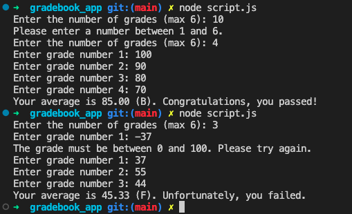

# Gradebook APP

A simple gradebook app with taht can calculate an average, convert a number range to a letter, check if a student failed or passed and print out a message.

Using node.js, the user can enter a a set number of grades (maximum of 6) and the program will calculate the average and then convert the average score into a letter grade and informs the user if they passed or failed based on the average.

## Table of Contents

[Description](#gradebook-app) | [Features](#features) | [Technologies Used](#technologies-used) | [Installation](#installation) | [Usage](#usage) | [Credits](#credits) 

## Features

1. **Calculates an average**: The app calculates the average of a set of scores using a "for" statement.

2. **Converts a number range to a letter**: It converts a numerical score range to a letter grade using an "if" statement.

3. **Checks if a student has passed or failed**: The app uses true/false boolean values to determine if a student has passed or failed.

4. **Prints out a message**: It can print out a message to indicate a student's grade and pass/fail status using already declared functions.


## Technologies Used

1. JavaScript
2. Node.js
3. Jest

## Installation

1. Clone the repository to your local machine.
2. Install the necessary dependencies using `npm install --save-dev jest`.

## Usage:

### Tests 

1. To run the tests, type `npx jest` in the terminal from the root directory of the project.

### In terminal

Open your terminal and navigate to the directory containing the script files.

1. Run this script in your terminal:

```
node script.js
```

Follow the prompts:

1. Enter the number of grades (max 6).
2. Enter each grade when prompted.
3. The script will then calculate the average, determine the letter grade, and display a message indicating whether you passed or failed.

## Result

Example:




## Credits

Initially designed, written and tested with [FreeCodeCamp.](https://www.freecodecamp.org/opin). This mini project is part of the  JavaScript Algorithm and Data Structures Certification, which teaches JavaScript fundamentals like variables, arrays, objects, loops, functions, the DOM, Object Oriented Programming (OOP), Functional Programming, algorithmic thinking, how to work with local storage, and how to fetch data using an API.

### Modifications: 

1. Interactive Command-Line Interface: The script interacts with the user via the terminal, asking for the number of grades and the grades themselves.
2. Validation: Ensures the number of grades entered is between 1 and 6 and each grade is between 0 and 100.
3. Pass/Fail Notification: Informs the user if they passed or failed based on the calculated average.

These changes were made to both personalize the project and improve upon the initial design, ensuring a more polished and efficient final product.